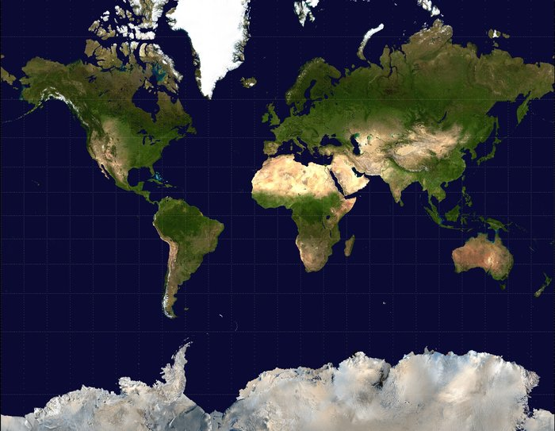

libsaim
======

[](https://app.fossa.io/projects/git%2Bgithub.com%2FShtille%2Flibsaim?ref=badge_shield)

Downloads, stores and renders tiles from any web tiling service.



`libsaim` is a small library written in C with few dependencies. It downloads tiles via `libcurl` and places images into efficient and fast local storage (up to 2Gb). Then on any request it gets image from the storage, decompresses it via `libjpeg` or `libpng`, puts into RAM and renders into target buffer very fast.
Really comes in handy when you're going to create some application with satellite imagery.
Tiling service should store JPEG or PNG images in [mercator projection](https://en.wikipedia.org/wiki/Mercator_projection).
All library functions are meant to be _synchronous_. Make sure its calls are guarded.

How to get
------------

```
git clone https://github.com/Shtille/libsaim.git .
```

Building
--------

### Windows (MinGW makefile)
```
mingw32-make
```
To build via Visual Studio there is a project in `builds` directory.

### Mac OS X
```
make
```
To build with Xcode or other IDE you will need to include all the sources in your project and add a define `SAIM_STATICLIB` if you're building static library.

### Other Unix platform
You should have `libcurl` installed before calling to
```
make
```

### Options for makefile
There are following options for `make` call:
* `LIBRARY_PATH` - the path where all libraries were installed by owner makefile. By default `lib` directory is being created.
* `USE_THIRDPARTY` - the flag that tells makefile to build inner thirdparty libraries or not. By default it uses inner libraries.

Dependencies
-------------------

`libsaim` depends on following libraries:
* libcurl
* libjpeg
* libpng
* zlib

All the libraries are included to `thirdparty` folder. But `libcurl` is excluded from build on all platforms but Windows.
Mac OS X provides libcurl with command line tools. So you dont even care about that on these two platforms.
For building on Linux or any other platform you should define path to your `libcurl` in environment variables.
If you already have mentioned above thirdparty libraries in your lib directory then just two additional parameters for parent makefile:
```
make -C saim saim LIBRARY_PATH=~/dev/app/lib USE_THIRDPARTY=NO
```
or when you're already using `LIBRARY_PATH` variable in makefile(s):
```
make -C saim saim USE_THIRDPARTY=NO
```
So target file is being installed into `LIBRARY_PATH` or into local `lib` directory when option hasn't been passed.

Examples
--------

To use this library in your project just include `saim.h` file in `include` directory.
It provides few functions:
* `saim_init` - library initialization
* `saim_cleanup` - library deinitialization
* `saim_set_target` - setups target buffer sizes and bitness
* `saim_render_aligned` - renders rectangle with all sides parallel to geodetic axis
* `saim_render_common` - renders rectangle that is rotated clock wise
* `saim_render_mapped_cube` - renders rectangle for cube face that is being projected onto sphere

Also there's a working example in `/src/tests/app_c` directory.

If you feel like using another tile service you should copy formatted char string into `string` member of `saim_provider_info` argument.

This string should be something like: `http://my.imagery.server.com/tile/{z}/{y}/{x}`.
- Parameter `{z}` corresponds for a tile level (between `min_lod` and `max_lod`).
- Parameter `{x}` corresponds for a tile x coordinate (between `0` and `(1 << z)-1`).
- Parameter `{y}` corresponds for a tile y coordinate (between `0` and `(1 << z)-1`).

Contributing
------------

I'm open to any contributions that helps `libsaim`!  If you find bugs, please
create an issue or do a pull request :smile:.

License
-------

[](https://app.fossa.io/projects/git%2Bgithub.com%2FShtille%2Flibsaim?ref=badge_large)

[zlib/libpng](https://opensource.org/licenses/zlib-license.php)

Copyright (c) 2016-2021 Sviridov Vladimir